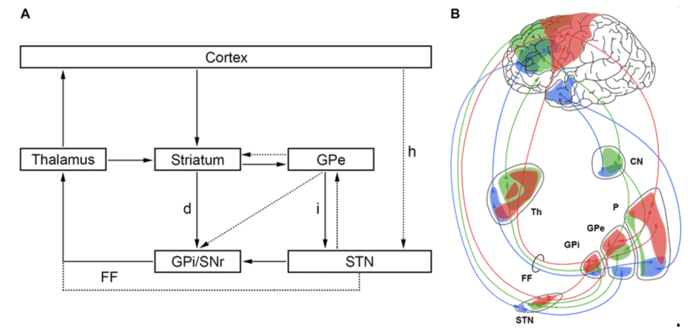

# 🧠 Basal Ganglia Action Selection with FUS Modulation  
**Interactive simulation built in Nengo and Jupyter/Colab**

This project models how the **basal ganglia (BG)** select between competing cortical actions and how **focused ultrasound (FUS)** can transiently bias that process — analogous to attenuation of corticostriatal drive in the **anterior limb of the internal capsule (ALIC)** for OCD treatment.

The notebook provides sliders to control cortical input strength, FUS intensity, and timing, allowing live visualisation of the effects on BG and thalamic output.

---

## 🔍 Background

In the **cortico-striato-thalamo-cortical (CSTC)** circuit, the basal ganglia inhibit all actions by default and selectively disinhibit the most salient one.  
By temporarily reducing cortical input to the striatum, FUS can shift this competition — suppressing an overactive action channel and restoring normal gating.

📖 *For background:*  
[Calzà et al., 2019 — *Altered Cortico-Striatal Functional Connectivity During Resting State in OCD*](https://pmc.ncbi.nlm.nih.gov/articles/PMC6524661/)

<p align="center">
  <br>
  <em>Schematic representation of cortico-striato-thalamo-cortical loops.</em>
</p>

Built in **Nengo**, a biologically grounded neural simulation framework for modelling circuit-level hypotheses and modulation effects.

---

## ⚙️ Installation

**Requirements**
- Python ≥ 3.10  
- Jupyter / VS Code / Colab  
- `pip install -r requirements.txt`  

or install manually:
```bash
pip install nengo matplotlib ipywidgets scipy
```

---

## ▶️ Quick Start

### Run locally (VS Code or Jupyter)
```bash
jupyter notebook notebooks/bg_fus_interactive.ipynb
```
or open the notebook in VS Code and run the cells.  
Use the sliders to adjust:
- **A1**, **A2** – cortical drive to each action  
- **κ (kappa)** – FUS attenuation strength  
- **FUS start**, **duration** – stimulation timing  

### Run on Colab
Click the badge below to open an editable online version:

[](https://colab.research.google.com/github/mendea/brain-network-model-demo/blob/main/notebooks/bg_fus_interactive.ipynb)

---

## 🧩 What to Observe

| Phase | Expected behaviour |
|-------|--------------------|
| **Pre-FUS** | Stronger cortical input dominates; one BG channel disinhibited. |
| **During FUS** | Affected channel’s input attenuated → competing channel may win. |
| **Post-FUS** | Normal competition resumes; thalamic outputs stabilise. |

---

## 📁 Files

| File | Purpose |
|------|----------|
| `notebooks/bg_fus_interactive.ipynb` | Main interactive notebook |
| `src/bg_action_fus.py` | Stand-alone Nengo-GUI script |
| `requirements.txt` | Package list |
| `README.md` | This document |

---

## 🌱 Next Steps
- Add realistic **FUS pulse trains** or **PRF-locked modulation**.  
- Extend to 3–4 cortical actions or oscillatory inputs.  
- Derive **EEG-like readouts** for experimental predictions.  
- Couple the model to higher-level cognitive simulations.  
