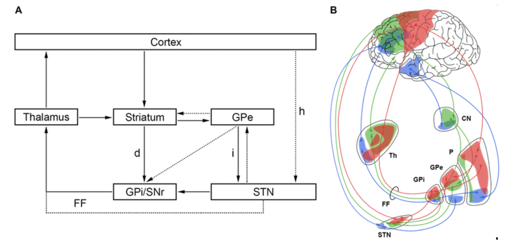

# 🧠 Brain Network Model Demo  
**Basal Ganglia Action Selection & Focused Ultrasound (FUS) Modulation**

This project provides interactive and script-based models of how the basal ganglia (BG) select between competing cortical actions, and how focused ultrasound (FUS) might modulate that process — for example, by reducing corticostriatal drive in the anterior limb of the internal capsule (ALIC) relevant to OCD treatments.

In the cortico-striato-thalamo-cortical (CSTC) loop the BG hold actions under tonic inhibition, then disinhibit the most salient one via thalamic relay.  
📖 *For background: [Calzà J et al., 2019 – Altered Cortico-Striatal Functional Connectivity During Resting State in OCD](https://pmc.ncbi.nlm.nih.gov/articles/PMC6524661/)*

<p align="center">
  <br>
  <em>Schematic representation of cortico-striato-thalamo-cortical loops.</em>
</p>

---

## 🧩 Models included

### 1. **BG + FUS attenuation model**  
- Script: `src/bg_fus_interactive.py`  
- Notebook: `notebooks/bg_fus_interactive.ipynb`  
- **Concept:** Two cortical action drives feed BG → Thalamus. A transient attenuation (FUS) reduces the stronger drive (`A1`) during a window, testing how action selection flips under modulation.  
- **Colab notebook** [](https://colab.research.google.com/github/shickselate/model-t/blob/main/notebooks/bg_fus_interactive.ipynb)

### 2. **BG + GPi suppression model**  
- Script: `src/bg_gpi_suppression_demo.py`  
- Notebook: `notebooks/bg_gpi_suppression_demo.ipynb`  
- **Concept:** Same two-channel architecture, but with an explicit GPi→Thalamus inhibitory node that is globally scaled by `gpi_scale(t)`. Strong suppression reveals a **global disinhibition** regime (both channels elevate) — a reversal of typical gating.  
- **Colab notebook** [](https://colab.research.google.com/github/shickselate/model-t/blob/main/notebooks/bg_gpi_suppression_demo.ipynb)

---

## ⚙️ Installation & Quick Start

### Installation  
```bash
git clone https://github.com/mendea/brain-network-model-demo.git
cd brain-network-model-demo

# (Optional) create virtual environment
python3 -m venv .venv
source .venv/bin/activate   # macOS/Linux
# .\.venv\\Scripts\\activate # Windows PowerShell

pip install -r requirements.txt
```
If no requirements.txt yet:

```
pip install nengo matplotlib ipywidgets scipy
```

## Running the interactive notebook (Colab or locally)

- Click the Colab links above to run in Google Colab.

- Or open the notebook in VS Code / Jupyter and run all cells; use the sliders to adjust parameters and explore behaviour.

## Running the Python scripts

```
# Headless (plots)
python src/bg_fus_interactive.py
python src/bg_gpi_suppression_demo.py

# With Nengo GUI (interactive model view)
nengo src/bg_fus_interactive.py
nengo src/bg_gpi_suppression_demo.py
```


### What to explore

- How varying the FUS attenuation (kappa) or GPi scaling (gpi_scale_base) changes which action wins.

- How timing (fus_start, fus_dur) affects outcome.

- When moderate suppression causes an action flip, and when strong suppression causes global disinhibition.

- Potential extensions: add noise/oscillations, map to behavioural tasks, derive EEG-like signatures for experimental predictions.


## File structure
```
brain-network-model-demo/
  notebooks/
    bg_fus_interactive.ipynb
    bg_gpi_suppression_demo.ipynb
  src/
    bg_fus_interactive.py
    bg_gpi_suppression_demo.py
  README.md
  requirements.txt
  .gitignore
```


  Enjoy exploring the models — and feel free to open issues or pull requests if you build a new extension!
